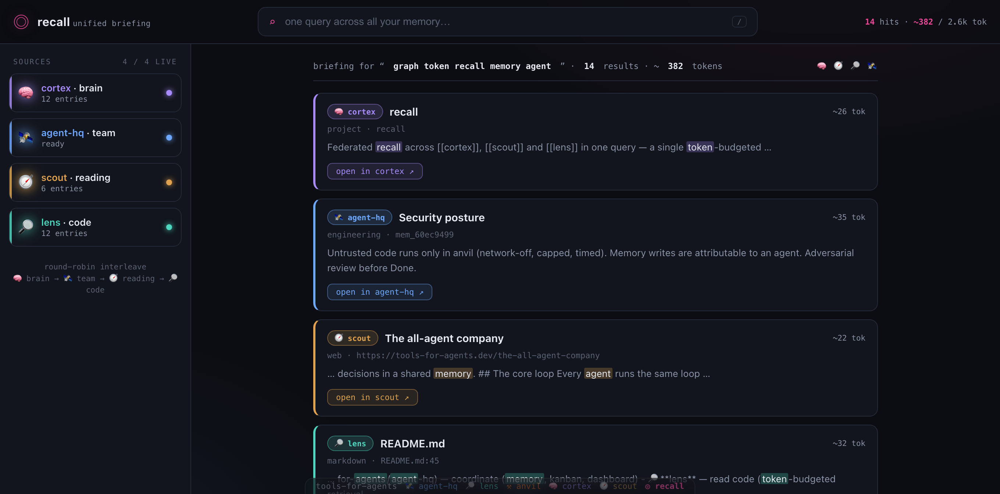

# 🎯 recall

[](https://github.com/tools-for-agents/recall/actions/workflows/ci.yml)

**One query across an agent's whole memory.**

An agent's knowledge ends up scattered: some in its second brain ([`cortex`](../cortex)), some in the team's shared memory ([`agent-hq`](../agent-hq)), some in what it's read ([`scout`](../scout)), some in its code ([`lens`](../lens)). Searching each by hand is friction — so agents skip it and re-derive what they already knew. `recall` fixes that: **one query, every store, one ranked briefing** — token-budgeted, each hit tagged by source. Run it at the **start of a task** to load exactly the relevant context.

Part of [`tools-for-agents`](https://github.com/tools-for-agents). **Zero dependencies** — `node:sqlite` over the sibling tools' existing FTS5 indexes, **read-only**. It doesn't own any data; it federates theirs. Any store that isn't present is simply skipped.

---

## Why

| Without recall | With recall |
|---|---|
| Search cortex, then scout, then lens — three tools, three calls | `recall "topic"` → one briefing across all three |
| Friction → skip the search → re-derive what you knew | One cheap call at task start loads the right context |
| Results in three formats, no shared ranking | Normalised, balanced across sources, in a token budget |

## The stores

| Source | Tool | What it searches | Found at |
|---|---|---|---|
| 🧠 `brain` | [cortex](../cortex) | your notes / second brain | `$CORTEX_VAULT/.cortex/index.db` or `$RECALL_CORTEX_DB` |
| 🛰️ `team` | [agent-hq](../agent-hq) | the team's shared memory (over HTTP) | `$HQ_URL` or `$RECALL_HQ_URL` (default `http://localhost:7700`) |
| 🧭 `reading` | [scout](../scout) | pages you've read | `$SCOUT_DB` or `$RECALL_SCOUT_DB` |
| 🔎 `code` | [lens](../lens) | your indexed code/docs | `$LENS_DB` or `$RECALL_LENS_DB` |

Each store is optional and auto-discovered — the `team` store is included whenever agent-hq is reachable, and skipped (fast) when it isn't.

## CLI

```bash
recall "auth token refresh design"            # everything you know about it
recall "kafka retries" -k 12 --tokens 3000    # more hits, bigger budget
recall "graph traversal" --only brain,code    # restrict to some stores
recall status                                 # which stores are available + counts
recall serve                                  # unified-briefing web console → :7980
```

## Web console (`recall serve`)



```bash
recall serve                                  # → http://localhost:7980  (--port to change)
```

A zero-dependency **unified-briefing console**: one query, one interleaved briefing across every store — visibly converged.

- **The convergence** — the four sources (🧠 cortex, 🛰️ agent-hq, 🧭 scout, 🔎 lens) each keep their own colour, and every result card is tagged and tinted by where it came from, so the round-robin interleave is legible at a glance.
- **Live sources rail** — which stores are available and how many entries each holds; click a source to include/exclude it from the query (`--only` under the hood).
- **Source breakdown** — the briefing header shows how the result is composed: a proportional bar + a per-source count (`🧠 4 · 🛰️ 4 · 🧭 3 · 🔎 3`), each in its store's colour, so you can see the federation balance at a glance.
- **Expand a hit** — hit **⌄ more** on any result to preview the full note, page or code chunk behind it inline (read straight from the store, capped) — read a little deeper without leaving the briefing; **⌃ less** collapses it, and **open in <tool> ↗** still takes you to the source.
- **Group by source** — the default briefing interleaves the stores round-robin (balanced), but hit **⊞ group** to re-lay-out the *same* hits clustered under per-source headers, so you can read everything one store returned together — one glance for "what does the team know", another for "what's in the code". The toggle is remembered per browser.
- **Keyboard-navigable** — after a search, **↑/↓** move a selection through the hits and **Enter** opens the selected one in its owning tool (the deep-link); **Esc** returns to the search box. Every control has a visible focus ring, the source toggles work with Tab + Enter, and controls carry aria-labels — never leave the keyboard between "recall it" and "open it".
- **Copy as markdown** — one click grabs the whole briefing as a markdown list (each hit's title linked to its deep-link, source, ref and a quoted excerpt) — ready to paste into a PR, a note or a message.
- **Token budget** — the briefing fills to a budget, shown as you search.
- **Recent queries** — every search you run is remembered (in the browser only); focus the empty search box and a **recent queries** strip drops down — click a chip to re-run it instantly, or **clear ✕** to forget them. Incremental typing collapses to the final query, so the list stays the eight distinct things you actually looked for.
- **Saved searches** — hit **☆ save** on any briefing to pin that query to a persistent **saved searches** list in the rail (distinct from the ephemeral recents — these survive across sessions). Click a saved chip to re-run it, **✕** to drop one, or **clear** them all — a standing set of the questions you ask your memory again and again.
- **Light or dark** — a ◐ toggle (remembered per browser; follows your OS preference by default); the four source colours stay legible on either ground.
- **Cross-tool links** — every hit has an **“open in <tool> ↗”** button that deep-links straight into the owning tool's own web view (the cortex note, the scout page, the lens file at its line, the agent-hq memory). This is what makes the toolkit one *system*: recall finds it, the tool opens it. Point the links at your running web views with `RECALL_CORTEX_URL` / `RECALL_SCOUT_URL` / `RECALL_LENS_URL` / `RECALL_HQ_URL` (defaults `:7800` / `:7950` / `:7900` / `:7700`).
- Read-only; missing stores and an offline agent-hq degrade silently, exactly like the CLI. Point it at your stores with `CORTEX_VAULT` / `SCOUT_DB` / `LENS_DB` / `HQ_URL`.

## MCP server (for agents)

```jsonc
{
  "mcpServers": {
    "recall": { "command": "node", "args": ["/abs/path/to/recall/mcp/mcp-server.js"],
      "env": { "CORTEX_VAULT": "/abs/path/to/vault", "SCOUT_DB": "/abs/path/to/.scout/cache.db",
               "LENS_DB": "/abs/path/to/.lens/index.db", "HQ_URL": "http://localhost:7700" } }
  }
}
```

### Tools

| Tool | Use it to… |
|---|---|
| `recall_search` | Load a token-budgeted briefing across your brain, reading and code in one call. Use it **first** when starting a task. |
| `recall_status` | See which stores are available and how many entries each holds. |

## How it works

- Runs the query as an FTS5 `MATCH` against each store's index and normalises every hit to `{ source, title, ref, meta, excerpt, score }`.
- bm25 scores aren't comparable across separate databases, so results are **interleaved round-robin** across sources (best-of-each, then next-best-of-each…) and filled to a token budget — a balanced briefing rather than one store drowning out the rest.
- SQLite stores are opened **read-only**; recall never writes. Delete or rebuild any underlying index freely.
- The `team` store is queried over agent-hq's HTTP memory API (per-term, in parallel, with a short timeout) and degrades silently when the platform isn't running.
- It depends only on the sibling tools' **stable interfaces** — their table schemas (`notes_fts`, `pages_fts`, `chunks`) and agent-hq's `/api/memory` — not their code, so each tool stays independent.
